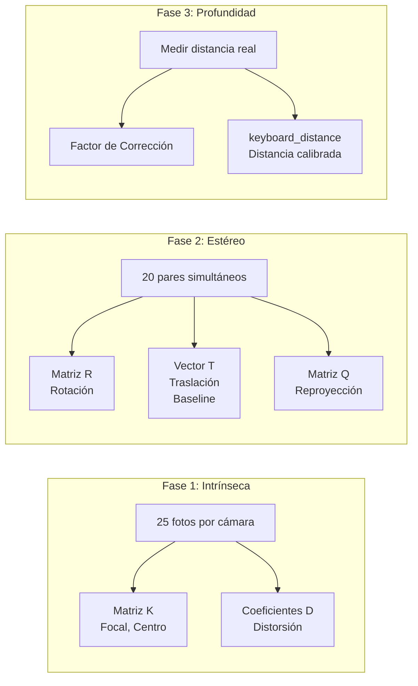
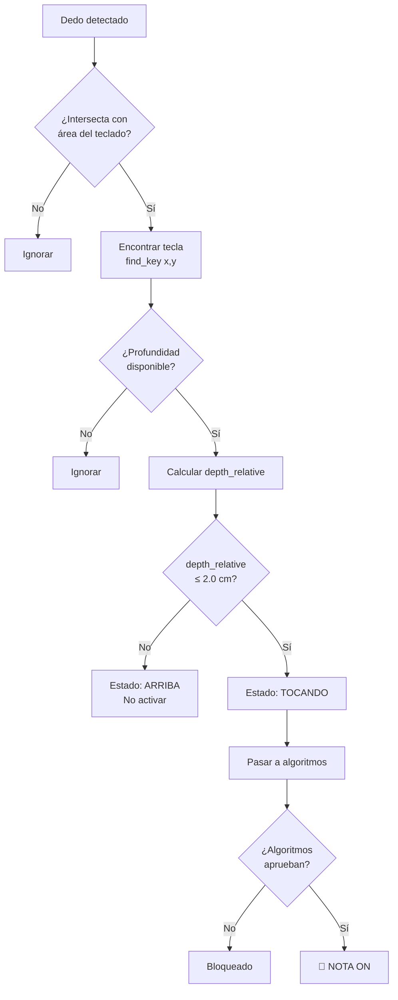

# 🎹 Piano Virtual con Visión Estéreo - Documentación Completa

## Índice
1. [Resumen del Proyecto](#resumen-del-proyecto)
2. [Arquitectura del Sistema](#arquitectura-del-sistema)
3. [Pipeline de Detección](#pipeline-de-detección)
4. [Calibración de Cámaras](#calibración-de-cámaras)
5. [Lógica de Toque de Tecla](#lógica-de-toque-de-tecla)
6. [Algoritmos de Filtrado](#algoritmos-de-filtrado)
7. [Configuración y Parámetros](#configuración-y-parámetros)

---

## Resumen del Proyecto

Este proyecto implementa un **piano virtual** que detecta las manos del usuario mediante **visión estéreo** (dos cámaras) y reproduce notas musicales cuando los dedos "tocan" un teclado proyectado en la imagen.

### Tecnologías Principales
- **MediaPipe Hands**: Detección de landmarks de manos (21 puntos por mano)
- **OpenCV**: Procesamiento de imágenes y calibración estéreo
- **FluidSynth**: Síntesis de audio MIDI
- **PyQt6**: Interfaz gráfica

---

## Arquitectura del Sistema

```mermaid
graph TB
    subgraph "Hardware"
        CAM_L[📷 Cámara Izquierda]
        CAM_R[📷 Cámara Derecha]
    end
    
    subgraph "Captura"
        CAPTURE[VideoCapture]
        CAM_L --> CAPTURE
        CAM_R --> CAPTURE
    end
    
    subgraph "Transformación"
        RAW[Frame RAW]
        DISPLAY[Frame DISPLAY<br/>Rotado 180°]
        CAPTURE --> RAW
        RAW --> DISPLAY
    end
    
    subgraph "Detección"
        HAND_L[HandDetector<br/>Izquierda]
        HAND_R[HandDetector<br/>Derecha]
        RAW --> HAND_L
        RAW --> HAND_R
    end
    
    subgraph "Triangulación"
        DEPTH[DepthEstimator]
        HAND_L --> DEPTH
        HAND_R --> DEPTH
        DEPTH --> Z[Profundidad Z cm]
    end
    
    subgraph "Mapeo"
        KEYBOARD[VirtualKeyboard]
        MAPPER[KeyboardMapper]
        Z --> MAPPER
        KEYBOARD --> MAPPER
    end
    
    subgraph "Algoritmos"
        SMOOTH[Suavizado de Profundidad]
        LIFT[Una Nota Por Acción]
        MAPPER --> SMOOTH
        SMOOTH --> LIFT
    end
    
    subgraph "Audio"
        SYNTH[FluidSynth]
        LIFT --> SYNTH
        SYNTH --> 🔊
    end
```

### Flujo de Datos Principal

```
┌─────────────┐     ┌─────────────┐     ┌─────────────┐     ┌─────────────┐
│  Captura    │ --> │  Detección  │ --> │Triangulación│ --> │   Mapeo     │
│  2 Cámaras  │     │  MediaPipe  │     │  Estéreo    │     │  Teclado    │
└─────────────┘     └─────────────┘     └─────────────┘     └─────────────┘
                                                                   │
                                                                   v
┌─────────────┐     ┌─────────────┐     ┌─────────────┐     ┌─────────────┐
│   Audio     │ <-- │ Algoritmos  │ <-- │  Filtrado   │ <-- │ Profundidad │
│  FluidSynth │     │   Pipeline  │     │  Outliers   │     │   Z (cm)    │
└─────────────┘     └─────────────┘     └─────────────┘     └─────────────┘
```

---

## Pipeline de Detección

### Paso 1: Captura de Frames
```python
# Captura simultánea de ambas cámaras
ret_left, frame_left = cap_left.read()   # Cámara Izquierda (ID: 1)
ret_right, frame_right = cap_right.read() # Cámara Derecha (ID: 2)

# Aplicar transformación RAW (identidad - no modifica)
frame_left = StereoConfig.apply_camera_transforms(frame_left)
frame_right = StereoConfig.apply_camera_transforms(frame_right)
```

### Paso 2: Detección de Manos
```python
# Detectar landmarks en imagen RAW (coordenadas reales)
hand_detector_left.findHands(frame_left)
hand_detector_right.findHands(frame_right)

# Obtener posiciones de puntas de dedos
# Retorna: [(hand_id, tip_id, x_pixel, y_pixel), ...]
hl_tips = hand_detector_left.getFingerTipsPos()
hr_tips = hand_detector_right.getFingerTipsPos()
```

### Paso 3: Triangulación Estéreo
```python
# Para cada dedo visible en AMBAS cámaras
for finger_left, finger_right in matching_fingers:
    # 1. Rectificar puntos (corregir distorsión)
    pt_l_rect = depth_estimator.rectify_point(finger_left, 'left')
    pt_r_rect = depth_estimator.rectify_point(finger_right, 'right')
    
    # 2. Triangular: Obtener punto 3D
    point_3d = depth_estimator.triangulate_point(pt_l_rect, pt_r_rect)
    # point_3d = (X, Y, Z) en centímetros desde la cámara
    
    # 3. Calcular profundidad relativa al teclado
    depth_absolute = point_3d[2]  # Z = distancia desde cámaras
    depth_relative = keyboard_distance - depth_absolute
    # depth_relative < 0 = dedo DEBAJO del teclado (tocando)
    # depth_relative > 0 = dedo ARRIBA del teclado (aire)
```

### Paso 4: Transformación para Visualización
```python
# Para mostrar al usuario (efecto selfie + orientación natural)
frame_display = StereoConfig.apply_display_transform(frame_left)
# Esto aplica ROTATE_180: Usuario aparece abajo, teclado arriba

# Transformar coordenadas de dedos para dibujarlos correctamente
def transform_point_for_display(point, width, height):
    x, y = point
    return (width - x, height - y)  # Rotación 180°
```

---

## Posición de Cámaras y Rotación Visual

### Setup Físico

```
                    ┌─────────────────────────────┐
                    │     CÁMARAS (arriba)        │
                    │   [📷 L]       [📷 R]       │
                    │      ↓           ↓          │
                    │   ~11.6cm de separación     │
                    └─────────────────────────────┘
                                 │
                                 │ ~49 cm (distancia calibrada)
                                 │
                                 ▼
        ════════════════════════════════════════════
        │  MESA / TECLADO VIRTUAL                  │
        ════════════════════════════════════════════
                                 │
                                 │
                    ┌────────────────────┐
                    │     USUARIO        │
                    │    (sentado)       │
                    └────────────────────┘
```

### Problema: Imagen "Al Revés"

Sin transformación, la cámara ve al usuario **arriba** y el teclado **abajo**:

```
┌──────────────────────────────┐
│  👤 USUARIO (arriba)         │  ← El usuario aparece arriba
│                              │
│  ─────────────────────       │
│  🎹 TECLADO                  │  ← Teclado abajo
│  Do Re Mi Fa Sol La Si       │
└──────────────────────────────┘
        Vista RAW (sin rotar)
```

**Problema**: El usuario tiene que "tocar hacia abajo" pero visualmente sus manos van "hacia arriba". ¡Confuso!

### Solución: Rotación 180°

Aplicamos `cv2.rotate(frame, cv2.ROTATE_180)` para visualización:

```
┌──────────────────────────────┐
│  🎹 TECLADO (arriba)         │  ← Teclado ahora arriba
│  Do Re Mi Fa Sol La Si       │
│  ─────────────────────       │
│                              │
│  👤 USUARIO (abajo)          │  ← Usuario abajo (natural)
└──────────────────────────────┘
        Vista DISPLAY (rotada 180°)
```

**Beneficios**:
1. ✅ Mover mano DERECHA = se ve a la DERECHA (efecto selfie)
2. ✅ El teclado está "frente" al usuario
3. ✅ Posición natural como un piano real

### Separación de Responsabilidades

```python
# 1. DETECCIÓN: Usar imagen RAW (coordenadas reales para matemáticas)
frame_raw = StereoConfig.apply_camera_transforms(frame)  # Identidad
hand_detector.findHands(frame_raw)  # Detectar en imagen sin rotar

# 2. VISUALIZACIÓN: Rotar para mostrar al usuario
frame_display = StereoConfig.apply_display_transform(frame_raw)  # Rotate 180°

# 3. DIBUJAR: Sobre imagen rotada, con coordenadas transformadas
hand_detector.drawHands(frame_display, rotate_180=True)
virtual_keyboard.draw(frame_display)

# 4. INTERACCIÓN: Transformar coordenadas del dedo para coincidir con display
x_visual, y_visual = transform_point_for_display((x_raw, y_raw), width, height)
# transform = (width - x, height - y)  ← Misma transformación que ROTATE_180
```

---

## Calibración de Cámaras

### Las 3 Fases de Calibración



### Parámetros Críticos de Calibración

| Parámetro | Descripción | Ejemplo |
|-----------|-------------|---------|
| `Tx` (Translation X) | Distancia horizontal entre cámaras | ~11.6 cm |
| `baseline_cm` | Igual que Tx, en centímetros | 11.65 cm |
| `rms_error` | Error de reproyección estéreo | < 1.0 es bueno |
| `keyboard_distance_cm` | Distancia de referencia del teclado | 49 cm |
| `correction_factor` | Ajuste fino de medición | ~0.93 |

### Fórmula de Triangulación

```
        baseline * focal_length
Z = ─────────────────────────────
           disparity

Donde:
- baseline = distancia entre cámaras (Tx)
- focal_length = distancia focal (de matriz K)
- disparity = diferencia en píxeles (x_left - x_right)
```

---

## Lógica de Toque de Tecla

### Diagrama de Decisión



### Umbrales de Activación

```python
# En keyboard_mapper.py
activation_threshold = 2.0  # cm

# Lógica:
if depth_relative <= activation_threshold:
    # TOCANDO: El dedo está a menos de 2cm del plano del teclado
    should_activate = True
else:
    # ARRIBA: El dedo está en el aire
    should_activate = False
```

### Diagrama Visual de Zonas de Profundidad

```
    CÁMARAS (mirando hacia abajo)
         ↓ ↓
         │ │
         │ │                    depth_absolute = 35cm
    ─────┼─┼──── ZONA ALTA     depth_relative = +14cm
         │ │    (NO TOCA)       
    ─────┼─┼──── zona intermedia  depth_absolute = 45cm
         │ │    (depth > 2cm)   depth_relative = +4cm
         │ │                    
    ═════╪═╪════ ZONA DE ACTIVACIÓN ═══════════════════
         │ │    (depth ≤ 2cm)   depth_absolute = 47-51cm
    ─────┼─┼──── keyboard_distance = 49cm ─────────────
         │ │    depth_relative = 0cm (referencia)
    ═════╪═╪════════════════════════════════════════════
         │ │                    
    ▓▓▓▓▓▓▓▓▓▓▓▓ MESA FÍSICA ▓▓▓▓▓▓▓▓▓▓▓▓▓▓▓▓▓▓▓▓▓▓▓▓
         │ │    depth_absolute = 52cm
         │ │    depth_relative = -3cm (negativo = debajo)
```

### Estados del Dedo

| Estado | depth_relative | Acción |
|--------|----------------|--------|
| `ARRIBA` | > 5cm | No activar, sin cooldown |
| `INTERMEDIO` | 2-5cm | No activar (zona de transición) |
| `TOCANDO` | ≤ 2cm | **ACTIVAR NOTA** (si algoritmos aprueban) |
| `PRESIONANDO` | < 0cm | Mantener nota activa |

### Fórmulas Clave

```python
# 1. Profundidad Absoluta (desde las cámaras)
depth_absolute = triangulate_point(left_point, right_point).Z

# 2. Profundidad Relativa (respecto al teclado calibrado)
depth_relative = keyboard_distance - depth_absolute

# 3. Interpretación
if depth_relative > 0:
    # Dedo está ARRIBA del teclado (en el aire)
    # Ejemplo: depth_relative = +10 significa 10cm arriba
elif depth_relative <= 0:
    # Dedo está AL NIVEL o DEBAJO del teclado (tocando/presionando)
    # Ejemplo: depth_relative = -2 significa 2cm debajo

# 4. Decisión de activación
should_activate = (depth_relative <= 2.0)  # 2cm de tolerancia
```

### ¿Por qué 2cm de tolerancia?

```
Sin tolerancia (depth ≤ 0):
  ❌ Muy estricto, difícil de tocar exactamente
  ❌ Ruido de tracking causa parpadeo

Con 2cm de tolerancia (depth ≤ 2):
  ✅ Activa cuando el dedo "casi toca"
  ✅ Más natural y perdonador
  ✅ Compensa ruido de medición
```

---

## Algoritmos de Filtrado

### 1. Suavizado de Profundidad (`Suavizado de Profundidad`)

**Propósito**: Reducir ruido de tracking de MediaPipe.

```python
def smooth_depth(depth_history, current_depth, window=3, threshold=15.0):
    """
    Aplica filtro temporal con rechazo de outliers.
    
    Args:
        depth_history: Historial de mediciones recientes
        current_depth: Medición actual
        window: Número de muestras para promediar
        threshold: Máxima desviación permitida del median
    """
    recent = depth_history[-window:]
    median = sorted(recent)[len(recent)//2]
    
    # Filtrar outliers (valores muy alejados del median)
    valid = [v for v in recent if abs(v - median) < threshold]
    
    if valid:
        return sum(valid) / len(valid)
    return current_depth
```

**Parámetros configurables:**
- `smoothing_window`: 3-15 frames (default: 6)
- `outlier_threshold`: 5-30 cm (default: 15)

### 2. Una Nota Por Acción (`UnaNotaPorAccionAlgorithm`)

**Propósito**: Evitar activaciones múltiples y proteger contra rebotes.

```python
def process(detection):
    """
    Filtra detecciones basándose en velocidad.
    
    LIFT GUARD: Bloquea si velocity < -5.0
    (movimiento hacia abajo demasiado rápido = ruido)
    """
    finger_id, key, depth, velocity, x, y = detection
    
    # Calcular velocidad: velocity = prev_depth - current_depth
    # velocity > 0 = acercándose (bajando hacia el teclado)
    # velocity < 0 = alejándose (subiendo)
    
    IS_LIFTING = velocity < -5.0  # Movimiento muy rápido hacia abajo
    
    if IS_LIFTING:
        # Bloquear y aplicar cooldown
        cooldown[finger_id] = 6  # frames
        return None  # No pasar
    
    if not in_cooldown(finger_id):
        return detection  # Pasar al siguiente algoritmo
```

**Parámetros:**
- `profundidad_reset`: 10.0 cm (altura para reset de estado)

---

## Configuración y Parámetros

### Archivos de Configuración

| Archivo | Contenido |
|---------|-----------|
| `camcalibration/calibration.json` | Matrices de calibración, distancias |
| `algorithms_config.py` | Parámetros de algoritmos |
| `stereo_config.py` | Configuración de transformaciones |
| `app_config.py` | Parámetros generales de la app |

### Parámetros Recomendados

Para un setup con teclado a **~50 cm** de las cámaras:

```python
# Suavizado de Profundidad
'Suavizado de Profundidad': {
    'enabled': True,
    'params': {
        'smoothing_window': 6,      # Balance suavidad/velocidad
        'outlier_threshold': 10.0,  # Filtra saltos > 10cm
    }
}

# Una Nota Por Acción
'Una Nota Por Acción': {
    'enabled': True,
    'params': {
        'profundidad_reset': 10.0,  # Reset si sube > 10cm
    }
}
```

### Valores de Profundidad Típicos

```
Situación                  | depth_absolute | depth_relative
---------------------------|----------------|----------------
Mano en aire alto          | 35 cm          | +14 cm (ARRIBA)
Mano acercándose           | 45 cm          | +4 cm (ZONA INTERMEDIA)
Dedo tocando teclado       | 49 cm          | 0 cm (TOCANDO)
Dedo presionando mesa      | 52 cm          | -3 cm (TOCANDO)
```

---

## Resumen para Implementadores

### Flujo Simplificado

```
1. CAPTURA: 2 cámaras → frames RAW
2. DETECCIÓN: MediaPipe → landmarks de dedos (x, y por cámara)
3. TRIANGULACIÓN: (x_left, x_right) → Z profundidad (cm)
4. MAPEO: (x, y) → tecla + Z → ¿tocando?
5. FILTRADO: Algoritmos deciden si activar
6. AUDIO: FluidSynth reproduce nota MIDI
```

### Puntos Críticos

1. **Calibración precisa** es fundamental (Fase 1, 2, 3)
2. **Transformaciones consistentes**: RAW para cálculos, DISPLAY para visualización
3. **Suavizado** combate ruido de tracking
4. **Velocidad** ayuda a detectar intención vs. ruido

### Archivos Principales

| Archivo | Responsabilidad |
|---------|-----------------|
| `qt_free_mode_window.py` | Loop principal de modo libre |
| `keyboard_mapper.py` | Mapeo dedos → teclas + algoritmos |
| `depth_estimator.py` | Triangulación estéreo |
| `virtual_keyboard.py` | Representación visual del teclado |
| `hand_detector.py` | Wrapper de MediaPipe |
| `algo_una_nota_por_accion.py` | Algoritmo de protección |

---

*Documentación generada el 2024-12-18*
